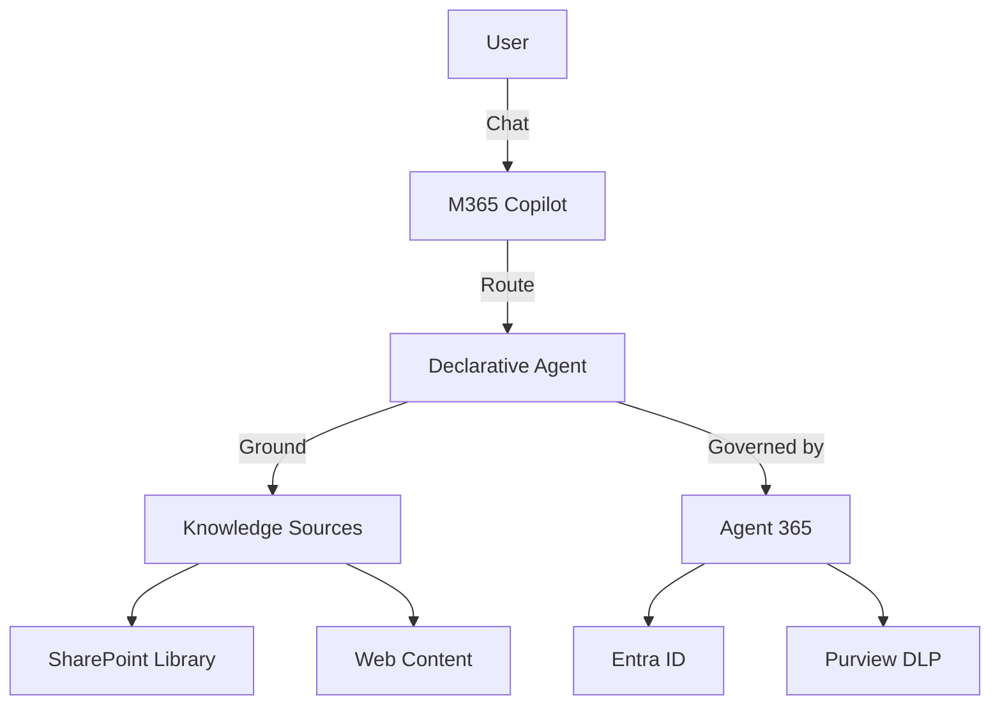
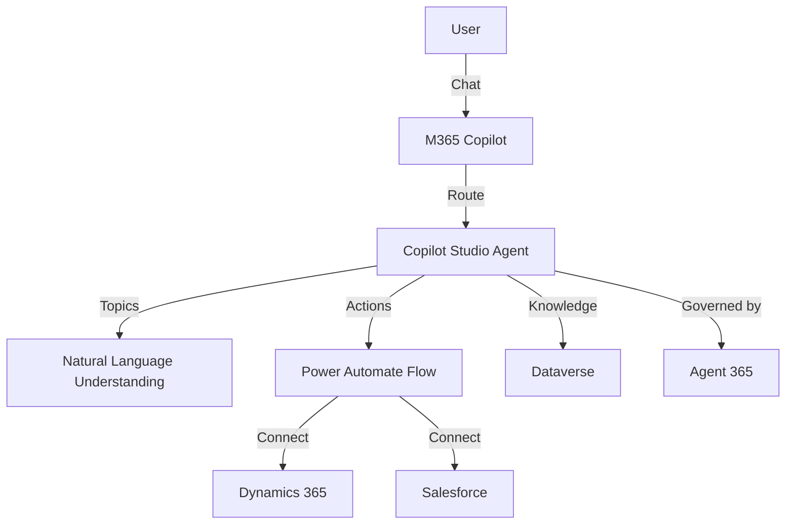
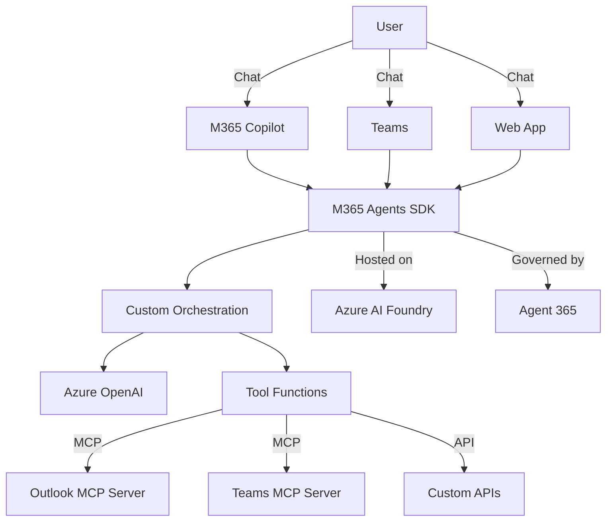
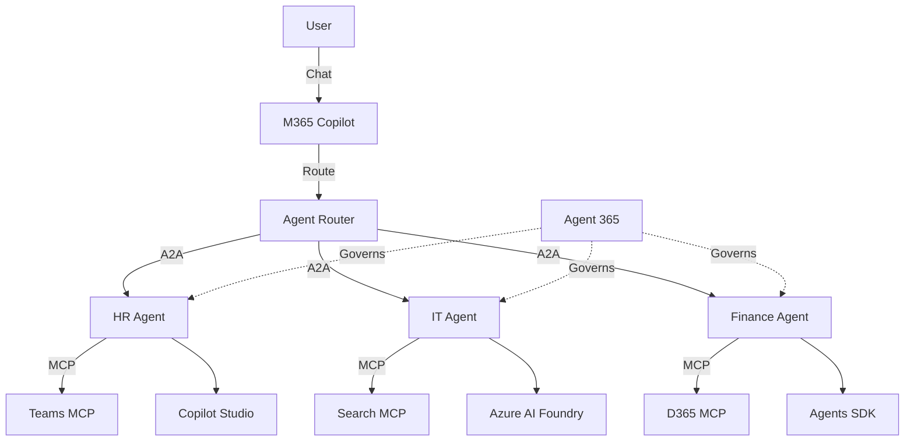
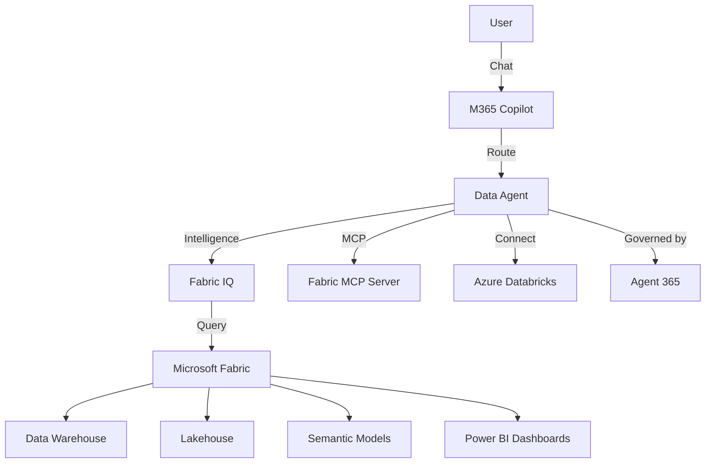
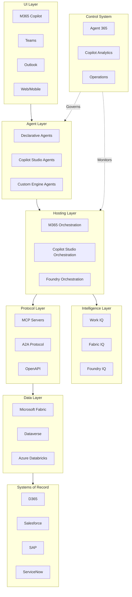

# Architecture Diagram Templates

Reusable Mermaid diagram templates for common agent solution architectures.

## Template 1: Simple Q&A Agent

## Template 2: Business Process Agent

## Template 3: Pro-Code Custom Engine Agent

## Template 4: Multi-Agent System

## Template 5: Enterprise Data Intelligence Agent

## Template 6: Full Enterprise Architecture

## Usage Notes

- Customize by replacing placeholder names with actual component names
- Add or remove nodes based on the specific solution
- Use solid arrows (-->) for data/request flow
- Use dashed arrows (-.->) for governance/monitoring relationships
- Use subgraphs to group related components
- Color-code by layer when rendering (UI=blue, Agents=green, Data=purple, Control=red)
